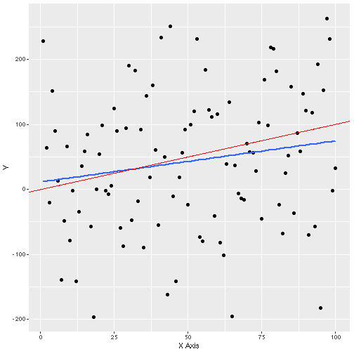
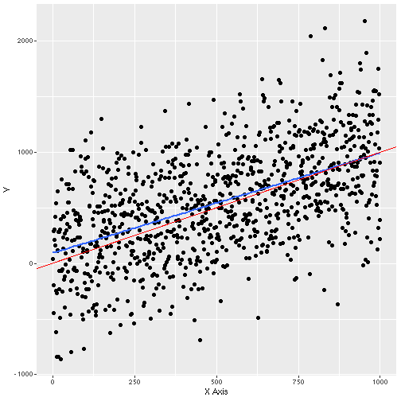

## Introduction

Shiny applications are a great way of allowing people to interact with data. Users can use sliders, boxes and other
types of input to manipulate and generate data.

This opens up a world of possibilities for the educational space, creating dynamic pages that allow students to enhance 
their learning opportunities.

---

## What Are We Solving

A student's first introduction to the world of regressions is a linear regression. This can often be an overwhelming experience
with a whole host of new terms and concepts introduced:

- Means
- Standard Deviations
- Confidence Intervals

How can we, interactively, introduce these concepts to a student?

---

## The Solution

**Shiny Applications!**

We have developed a Shiny application that allows a student to interact with a linear regression.

Using the Shiny application, the student can change parameters and get instance feedback on how this
changes the linear regression.

The student can change the following parameters:

- Mean of the $\epsilon$ error term.
- Standard deviation of the $\epsilon$ error term.
- The sample size.

---

## Example A

The following is an example of the output the student is initially shown, with sample size of 100, a mean of 10 and a standard deviation of 100:

---

## Example B

The following is an example of the output the student can manually change, with sample size of 1000, a mean of 50 and a standard deviation of 400:

---

## Thank You

